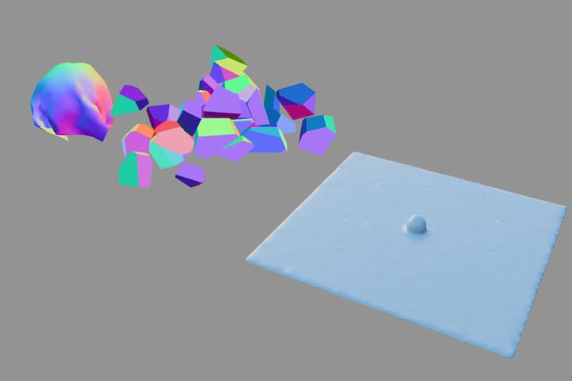

# Vertex Animation Textures

This is a simple example of how to use vertex animation textures with React Three Fiber (threejs). Vertex Animation Textures gives us the ability to encode vertex position data in the pixels of an image in order to drive the animation of a mesh. No rig is needed.

I used Custom Shader Material to create the shaders because it provides a nicer DX imo.

[Live Demo](https://r3f-webgl-vertex-animation-textures.vercel.app)

Feel free to use this code in your projects.

The textures were generated with [Houdini's VAT tools](https://www.artstation.com/artwork/zOyke6). The example uses exr files, but it shouldn't be too dificult to modify it to use 2 8bit textures if you're concerned about streaming large files.

## Getting Started

This project was bootstrapped with [Create React App](https://github.com/facebook/create-react-app).

### Available Scripts

In the project directory, you can run:

#### `npm start`

Runs the app in the development mode.\
Open [http://localhost:3000](http://localhost:3000) to view it in your browser.

The page will reload when you make changes.\
You may also see any lint errors in the console.
